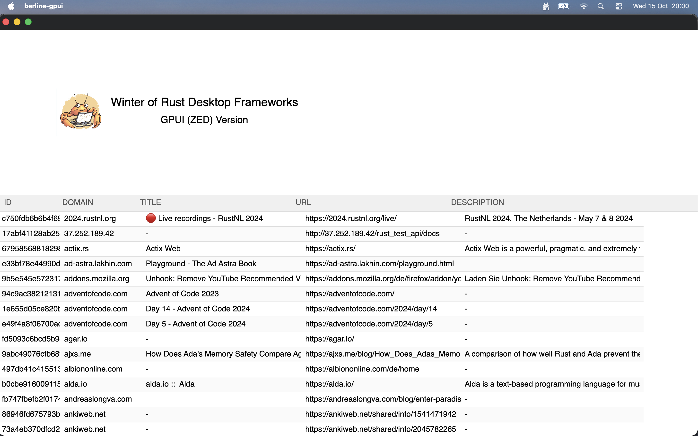

# GPUI

## Description

This is a simple fast POC only to experiment with ZED library GPUI used for their IDE.

Looks promising, to explore in the future...

## Build

```shell
cargo build --release
```

## Mac build for Windows

For Mac Users a preparation to build to Windows

```
brew install mingw-w64
rustup target add x86_64-pc-windows-gnu
```

```shell
cargo build --release --target x86_64-pc-windows-gnu
```

